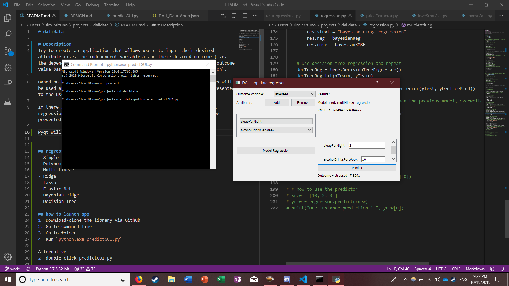

# dalidata

# Description
Try to create an application that allows users to input their desired attributes(i.e. the independent variables) and their desired outcome (i.e. the dependant variable that is based on the attributes) and predict a outcome value based on any numerical attribute available in `DATA-Data-Anon.json`. 

Based on how many attributes there are, a variety regression strategies will be used and the model with the least root mean square error will be presented to the user. 

If there is only one attribute specified, simple linear and polynomial regression will be used and the more accurate result of the two will be presented to the user.

Pyqt will be used to construct a suitable UI.

## regression methods used:
- Simple Linear
- Polynomial (limited to a degree of 5)
- Multi Linear
- Ridge
- Lasso
- Elastic Net
- Bayesian Ridge
- Decision Tree

## how to launch app
1. Download/clone the library via Github
2. Go to command line
3. Go to folder
4. Run `python.exe predictGUI.py`

Alternative
2. double click predictGUI.py

## libraries needed
This program uses pyqt5, pandas, numpy, and sklearn.